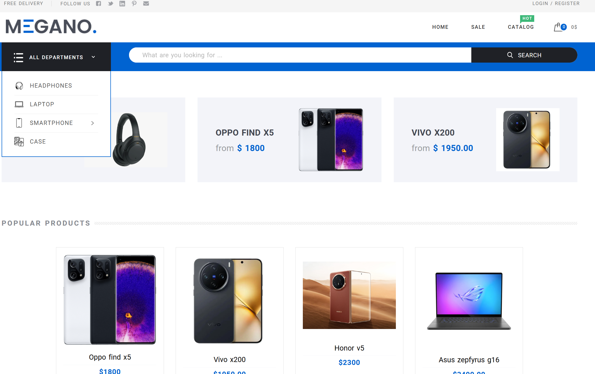

# Интернет-магазин техники

Проект интернет-магазина для продажи различной техники, разработанный на Django.

## 🚀 Функциональность

### Реализовано на текущий момент:
- ✅ Система регистрации и аутентификации пользователей
- ✅ Панель администратора Django
- ✅ Управление товарам 
- ✅ Управление категориями товаров
- ✅ Мягкое удаление записей
- ✅ Базовая структура проекта
- ✅ Каталог товаров с фильтрацией и сортировкой
- ✅ Корзина покупок
- ✅ Оформление заказов
- ✅ Личный кабинет пользователя
- ✅ Система отзывов


## 🛠 Технологический стек

- **Backend:** Django 4.2+
- **Database:** PostgreSQL
- **Web server:** Nginx
- **Containerization:** Docker + Docker Compose
- **Deployment:** Production-ready configuration

## 📋 Требования к системе

- Docker 20.10+
- Docker Compose 2.0+
- Python 3.10+ (для разработки)

## 🚀 Быстрый старт

### Установка и запуск

1. **Клонирование репозитория:**
```bash
git clone &lt;your-repository-url&gt;
cd Shop
docker-compose up -build
```

2. **Запуск приложения**
```
Приложение будет доступно по адресу: 0.0.0.0:80
```
